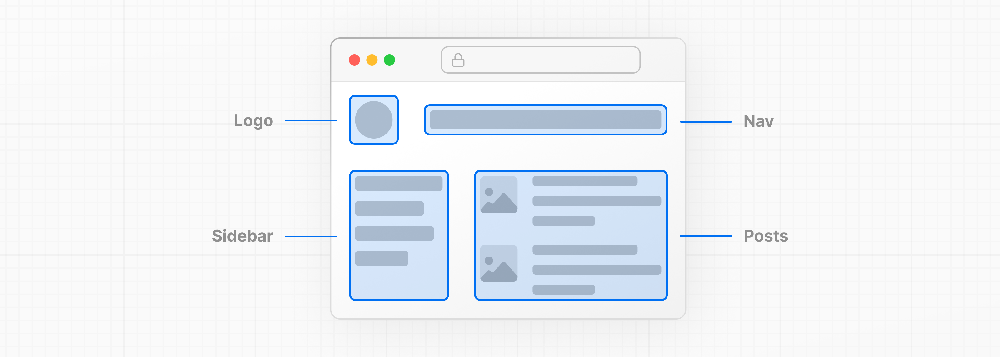
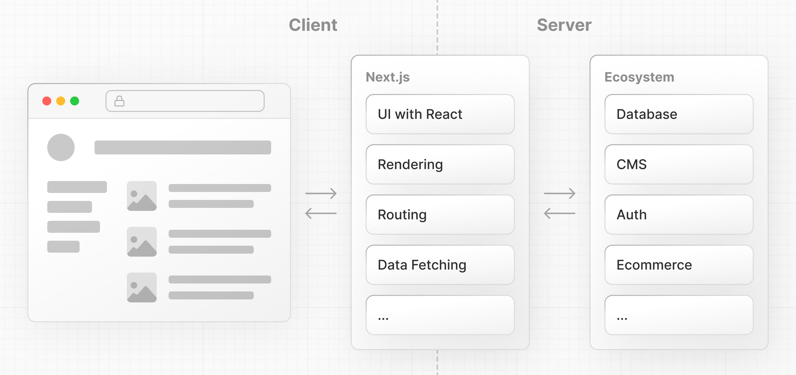

# 1장: React와 Next.js에 대하여 - About React and Next.js

Next.js는 빠르고 전체 스택 **웹 애플리케이션**을 생성하기 위한 구성 요소를 제공하는 유연한 **React 프레임워크**입니다.

이것이 정확히 무엇을 의미하는지, React와 Next.js가 무엇이며 어떻게 웹 애플리케이션을 구축하는 데 도움이 될 수 있는지에 대해 좀 더 자세히 알아보겠습니다.

### 웹 애플리케이션의 구성 요소 - Building blocks of a web application

현대 애플리케이션을 구축할 때 고려해야 할 몇 가지 사항이 있습니다. 예를 들면:

- **사용자 인터페이스** - 사용자가 애플리케이션을 어떻게 소비하고 상호 작용할지에 대한 부분.
- **라우팅** - 사용자가 애플리케이션의 다른 부분 간에 어떻게 이동하는지에 대한 부분.
- **데이터 가져오기** - 데이터가 어디에 존재하는지 및 어떻게 가져올지에 대한 부분.
- **렌더링** - 정적 또는 동적 콘텐츠를 언제 어디에 렌더링할지에 대한 부분.
- **통합** - 사용하는 제3자 서비스(CMS, 인증, 결제 등)와 이를 어떻게 연결할지에 대한 부분.
- **인프라** - 애플리케이션 코드를 배포, 저장, 실행할 위치(서버리스, CDN, 엣지 등)에 대한 부분.
- **성능** - 최종 사용자를 위해 애플리케이션을 어떻게 최적화할지에 대한 부분.
- **확장성** - 팀, 데이터, 트래픽이 성장함에 따라 애플리케이션이 어떻게 적응하는지에 대한 부분.
- **개발자 경험** - 팀이 애플리케이션을 구축하고 유지 관리하는 경험에 대한 부분.

애플리케이션의 각 부분에 대해, 직접 해결책을 구축할지 아니면 패키지, 라이브러리, 프레임워크와 같은 다른 도구를 사용할지 결정해야 합니다.

### React란 무엇인가? - What is React?

**React**는 **대화형 사용자 인터페이스**를 구축하기 위한 JavaScript **라이브러리**입니다.
> https://react.dev

사용자 인터페이스(UI)에 의해, 우리는 사용자가 화면상에서 보고 상호 작용하는 요소들을 의미합니다.

라이브러리에 의해, React는 UI를 구축하기 위한 유용한 함수(API)를 제공하지만, 개발자가 그 함수를 애플리케이션의 어디에 사용할지 결정하도록 합니다.

React의 성공의 일부는 애플리케이션을 구축하는 다른 측면에 대해 상대적으로 비의견적(unopinionated)이라는 것입니다. 이로 인해 Next.js를 포함한 제3자 도구 및 솔루션의 번성하는 생태계가 생겼습니다.

그러나 이는 또한, 바닥부터 완전한 React 애플리케이션을 구축하는 것이 어느 정도 노력을 필요로 한다는 것을 의미합니다. 개발자는 도구를 구성하고 일반적인 애플리케이션 요구 사항에 대한 해결책을 재발명하는 데 시간을 소비해야 합니다.

## Next.js란 무엇인가? - What is Next.js?

Next.js는 웹 애플리케이션을 생성하기 위한 구성 요소를 제공하는 React **프레임워크**입니다.

프레임워크에 의해, Next.js는 React에 필요한 도구와 구성을 처리하고, 애플리케이션에 추가 구조, 기능, 최적화를 제공합니다.

React를 사용하여 UI를 구축한 다음, 라우팅, 데이터 가져오기, 캐싱과 같은 일반적인 애플리케이션 요구 사항을 해결하기 위해 Next.js 기능을 점진적으로 채택할 수 있습니다 - 이 모든 것이 개발자와 최종 사용자 경험을 개선하면서 이루어집니다.

개인 개발자이든 더 큰 팀의 일부이든, React와 Next.js를 사용하여 완전히 상호작용이 가능하고, 매우 동적이며, 성능이 우수한 웹 애플리케이션을 구축할 수 있습니다.

다음 장에서는 React와 Next.js로 시작하는 방법에 대해 논의할 것입니다.
