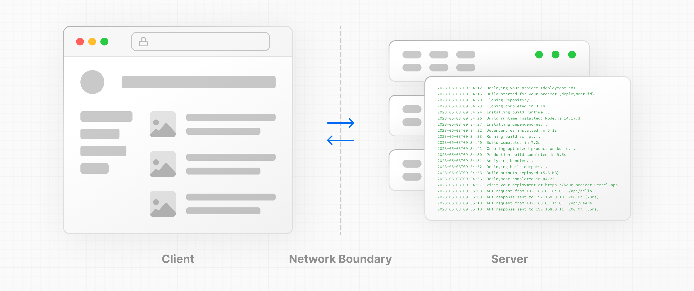
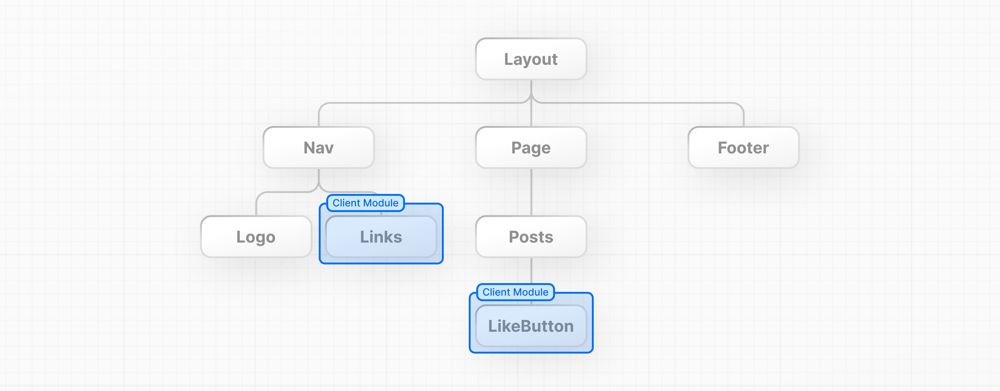

# 10장: 서버 및 클라이언트 컴포넌트 - Server and Client Components

서버 및 클라이언트 컴포넌트가 어떻게 작동하는지 이해하려면, 두 가지 기본적인 웹 개념을 알고 있으면 도움이 됩니다:

- 애플리케이션 코드가 실행될 수 있는 **환경**: 서버와 클라이언트.
- 서버와 클라이언트 코드를 분리하는 **네트워크 경계**.

## 서버 및 클라이언트 환경 - Server and Client Environments

웹 애플리케이션의 맥락에서:



- **클라이언트**는 사용자의 장치에 있는 브라우저를 의미하며, 서버에 애플리케이션 코드에 대한 요청을 보내고, 서버로부터 받은 응답을 사용자가 상호작용할 수 있는 인터페이스로 변환합니다.
- **서버**는 애플리케이션 코드를 저장하는 데이터 센터의 컴퓨터를 의미하며, 클라이언트로부터 요청을 받아 어떤 계산을 수행한 뒤 적절한 응답을 돌려보냅니다.

각 환경은 자체적인 기능과 제약을 가집니다. 예를 들어, 렌더링과 데이터 패칭을 서버로 이동시키면 클라이언트로 보내는 코드 양을 줄여 애플리케이션의 성능을 향상시킬 수 있습니다. 하지만, 앞서 배웠듯이 UI를 대화형으로 만들기 위해서는 클라이언트에서 DOM을 업데이트해야 합니다.

그러므로, 서버와 클라이언트를 위해 작성하는 코드는 항상 같지 않습니다. 특정 작업(예: 데이터 패칭이나 사용자 상태 관리)은 다른 환경보다 한 환경에 더 적합합니다.

## 네트워크 경계 - Network Boundary

**네트워크 경계**는 서로 다른 환경을 분리하는 개념적 선입니다.

React에서는 컴포넌트 트리에서 네트워크 경계를 어디에 둘지 선택합니다. 예를 들어, 서버에서 사용자의 게시물을 데이터 패칭하고 렌더링할 수 있습니다(서버 컴포넌트 사용), 그리고 각 게시물에 대해 대화형 `좋아요버튼`을 클라이언트에서 렌더링할 수 있습니다(클라이언트 컴포넌트 사용).

마찬가지로, 서버에서 렌더링되고 페이지 간에 공유되는 `Nav` 컴포넌트를 만들 수 있지만, 링크에 활성 상태를 표시하고 싶다면 클라이언트에서 `링크` 목록을 렌더링할 수 있습니다.



내부적으로, 컴포넌트는 두 모듈 그래프로 분리됩니다. **서버 모듈 그래프(또는 트리)**에는 서버에서 렌더링되는 모든 서

버 컴포넌트가 포함되고, **클라이언트 모듈 그래프(또는 트리)**에는 모든 클라이언트 컴포넌트가 포함됩니다.

서버 컴포넌트가 렌더링된 후, **React 서버 컴포넌트 페이로드(RSC)**라고 불리는 특별한 데이터 형식이 클라이언트로 전송됩니다. RSC 페이로드는 다음을 포함합니다:

1. 서버 컴포넌트의 렌더링 결과.
2. 클라이언트 컴포넌트가 렌더링될 위치의 플레이스홀더(또는 구멍)와 그들의 자바스크립트 파일에 대한 참조.

React는 이 정보를 사용하여 서버 및 클라이언트 컴포넌트를 통합하고 클라이언트에서 DOM을 업데이트합니다.

이 작동 방식을 살펴보겠습니다.

## 클라이언트 컴포넌트 사용하기 - Using Client Components

지난 장에서 배웠듯이, Next.js는 기본적으로 서버 컴포넌트를 사용합니다 - 이는 애플리케이션의 성능을 향상시키기 위함이며, 이를 채택하기 위해 추가적인 단계를 밟을 필요가 없음을 의미합니다.

브라우저에서의 오류를 돌이켜보면, Next.js는 서버 컴포넌트 내에서 `useState`를 사용하려고 한다고 경고하고 있습니다. 이를 해결하기 위해서는 상호작용하는 "좋아요" 버튼을 클라이언트 컴포넌트로 이동시키면 됩니다.

`app` 폴더 안에 `like-button.js`라는 새 파일을 생성하고 `LikeButton` 컴포넌트를 내보내세요:

`/app/like-button.js`

```
export default function LikeButton() {}
```

`page.js`에서 `<button>` 요소와 `handleClick()` 함수를 새로운 `LikeButton` 컴포넌트로 이동시키세요:

`/app/like-button.js`

```
export default function LikeButton() {
  function handleClick() {
    setLikes(likes + 1);
  }

  return <button onClick={handleClick}>Like ({likes})</button>;
}
```

다음으로, `likes` 상태와 import를 이동하세요:

`/app/like-button.js`

```
import { useState } from 'react';

export default function LikeButton() {
  const [likes, setLikes] = useState(0);

  function handleClick() {
    setLikes(likes + 1);
  }

  return <button onClick={handleClick}>좋아요 ({likes})</button>;
}
```

이제 `LikeButton`을 클라이언트 컴포넌트로 만들기 위해, 파일 상단에 React `'use client'` 지시어를 추가하세요. 이는 React에게 컴포넌트를 클라이언트에서 렌더링하라고 알려줍니다.

`/app/like-button.js`

```
'use client';

import { useState } from 'react';

export default function LikeButton() {
  const [likes, setLikes] = useState(0);

  function handleClick() {
    setLikes(likes + 1);
  }

  return <button onClick={handleClick}>Like ({likes})</button>;
}
```

`page.js` 파일로 돌아가서 `LikeButton` 컴포넌트를 페이지에 가져오세요:

`/app/page.js`

```
import LikeButton from './like-button';

function Header({ title }) {
  return <h1>{title ? title : '기본 제목'}</h1>;
}

export default function HomePage() {
  const names = ['Ada Lovelace', 'Grace Hopper', 'Margaret Hamilton']; 

  return (
    <div>
      <Header title="개발. 미리보기. 배포." />
      <ul>
        {names.map((name) => (
          <li key={name}>{name}</li>
        ))}
      </ul>
      <LikeButton />
    </div>
  );
}
```

두 파일을 저장하고 브라우저에서 앱을 보세요. 이제 오류가 없으므로 변경 사항을 만들고 저장하면, 브라우저가 자동으로 업데이트되어 변경 사항을 반영하는 것을 볼 수 있어야 합니다.

이 기능은 **Fast Refresh**라고 합니다. 변경하신 내용에 대해 즉각적인 피드백을 제공하며, Next.js와 함께 사전 구성되어 있습니다.
> **Fast Refresh**
> https://nextjs.org/docs/architecture/fast-refresh

## 요약 - Summary

이번 장을 통해, 서버 및 클라이언트 환경에 대해 배우고 각각을 언제 사용해야 하는지 알게 되었습니다. 또한, Next.js가 성능 향상을 위해 기본적으로 React 서버 컴포넌트를 사용하며, UI의 작은 부분을 대화형으로 만들기 위해 클라이언트 컴포넌트를 선택적으로 사용할 수 있는 방법을 배웠습니다.

> **추가 읽기**
> 
> 서버 및 클라이언트 컴포넌트에 대해 배울 내용이 훨씬 더 많습니다. 여기 몇 가지 추가 자료가 있습니다:
> 
> - 서버 컴포넌트 문서
> https://nextjs.org/docs/app/building-your-application/rendering/server-components
> - 클라이언트 컴포넌트 문서
> https://nextjs.org/docs/app/building-your-application/rendering/client-components
> - 컴포지션 패턴
> https://nextjs.org/docs/app/building-your-application/rendering/composition-patterns
> - "use client" 지시어
> https://react.dev/reference/react/use-client
> - "use server" 지시어
> https://react.dev/reference/react/use-server
