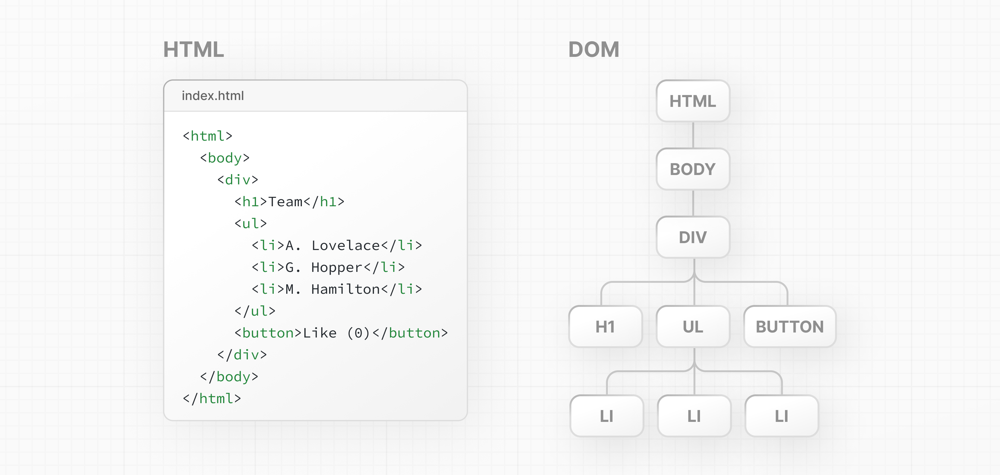

# 2장: 사용자 인터페이스(UI) 렌더링 - Rendering User Interfaces (UI)

React가 어떻게 작동하는지 이해하기 위해, 먼저 브라우저가 코드를 해석하여 사용자 인터페이스(UI)를 생성(또는 렌더링)하는 방법에 대한 기본적인 이해가 필요합니다.

사용자가 웹 페이지를 방문하면, 서버는 이렇게 생긴 HTML 파일을 브라우저에 반환합니다:

그런 다음 브라우저는 HTML을 읽고 문서 객체 모델(DOM)을 구성합니다.

### DOM이란 무엇인가? - What is the DOM?

DOM은 HTML 요소의 객체 표현입니다. 코드와 사용자 인터페이스 사이의 다리 역할을 하며, 부모와 자식 관계를 가진 트리 형태의 구조를 가집니다.

DOM 메소드와 JavaScript를 사용하여 사용자 이벤트를 감지하고, 사용자 인터페이스에서 특정 요소를 선택, 추가, 업데이트, 삭제하여 **DOM을 조작** 할 수 있습니다. DOM 조작을 통해 특정 요소를 대상으로 하여 스타일과 내용을 변경할 수 있습니다.
> **DOM 조작**
> https://developer.mozilla.org/docs/Learn/JavaScript/Client-side_web_APIs/Manipulating_documents

다음 섹션에서는 JavaScript와 DOM 메소드를 사용하는 방법을 배울 것입니다.

> **추가 자료:**
> 
> - DOM 소개
> https://developer.mozilla.org/docs/Web/API/Document_Object_Model/Introduction
> - Google Chrome에서 DOM 보기
> https://developer.chrome.com/docs/devtools/dom/
> - Firefox에서 DOM 보기
> https://developer.mozilla.org/docs/Tools/Debugger/How_to/Highlight_and_inspect_DOM_nodes

