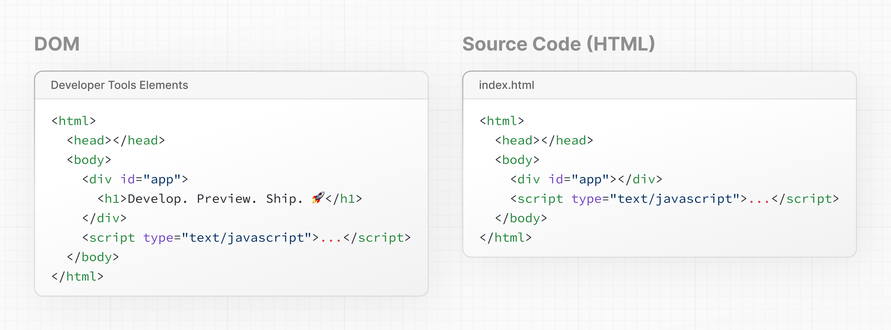

# 3장: 자바스크립트로 UI 업데이트하기 - Updating UI with Javascript


이 장에서는 자바스크립트와 DOM 메소드를 사용하여 프로젝트에 `h1` 태그를 추가하는 방법을 시작합니다.

코드 에디터를 열고 새로운 `index.html` 파일을 생성하세요. HTML 파일 안에 다음 코드를 추가하세요:

`index.html`

```html
<html>
  <body>
    <div></div>
  </body>
</html>
```

그런 다음 나중에 타겟할 수 있도록 `div`에 고유한 `id`를 부여하세요.

`index.html`

```
<html>
  <body>
    <div id="app"></div>
  </body>
</html>
```

HTML 파일 내에서 자바스크립트를 작성하려면 `script` 태그를 추가하세요:

`index.html`

```
<html>
  <body>
    <div id="app"></div>
    <script type="text/javascript"></script>
  </body>
</html>
```

이제 `script` 태그 내에서 **`getElementById()`** DOM 메소드를 사용하여 `id`로 `<div>` 요소를 선택할 수 있습니다:
> **getElementById()**
> [https://developer.mozilla.org/en-US/docs/Web/API/Document/getElementById](https://developer.mozilla.org/en-US/docs/Web/API/Document/getElementById)

`index.html`

```
<html>
  <body>
    <div id="app"></div>
    <script type="text/javascript">
      const app = document.getElementById('app');
    </script>
  </body>
</html>
```

DOM 메소드를 계속 사용하여 새로운 `<h1>` 요소를 생성할 수 있습니다:

`index.html`

```
<html>
  <body>
    <div id="app"></div>
    <script type="text/javascript">
      // 'app' id를 가진 div 요소 선택
      const app = document.getElementById('app');
 
      // 새로운 H1 요소 생성
      const header = document.createElement('h1');
 
      // H1 요소를 위한 새로운 텍스트 노드 생성
      const text = 'Develop. Preview. Ship.';
      const headerContent = document.createTextNode(text);
 
      // 텍스트를 H1 요소에 추가
      header.appendChild(headerContent);
 
      // H1 요소를 div 내부에 배치
      app.appendChild(header);
    </script>
  </body>
</html>
```

모든 것이 잘 작동하는지 확인하기 위해, 선택한 브라우저 내에서 HTML 파일을 엽니다. 'Develop. Preview. Ship.'이라고 하는 `h1` 태그가 보여야 합니다.

---

## HTML vs. DOM

**브라우저 개발자 도구** 내의 DOM 요소를 보면, DOM이 `<h1>` 요소를 포함하고 있는 것을 알 수 있습니다. 페이지의 DOM은 소스 코드, 즉 생성한 원본 HTML 파일과 다릅니다.
> **브라우저 개발자 도구**
> [https://developer.mozilla.org/docs/Learn/Common_questions/Tools_and_setup/What_are_browser_developer_tools](https://developer.mozilla.org/docs/Learn/Common_questions/Tools_and_setup/What_are_browser_developer_tools)



이는 HTML이 **초기 페이지 콘텐츠**를 나타내는 반면, DOM은 작성한 자바스크립트 코드에 의해 변경된 **업데이트된 페이지 콘텐츠**를 나타내기 때문입니다.

순수 자바스크립트로 DOM을 업데이트하는 것은 매우 강력하지만 장황할 수 있습니다. 몇 가지 텍스트와 함께 `<h1>` 요소를 추가하기 위해 이 모든 코드를 작성했습니다:

`index.html`

```
<script type="text/javascript">
  const app = document.getElementById('app');
  const header = document.createElement('h1');
  const text = 'Develop. Preview. Ship.';
  const headerContent = document.createTextNode(text);
  header.appendChild(headerContent);
  app.appendChild(header);
</script>
```

앱이나 팀의 크기가 커짐에 따라, 이런 방식으로 애플리케이션을 구축하는 것은 점점 더 도전적일 수 있습니다.

이 접근법으로 개발자는 컴퓨터에 **어떻게** 일을 해야 하는지 지시하는 데 많은 시간을 소비합니다. 하지만 컴퓨터가 DOM을 **어떻게** 업데이트할지 파악하게 하고, 당신이 보여주고 싶은 것을 **무엇**인지 설명하는 것이 좋지 않을까요?

---

## 명령형 vs. 선언형 프로그래밍 - Imperative vs. declarative programming

위의 코드는 **명령형** **프로그래밍**의 좋은 예입니다. 사용자 인터페이스가 **어떻게** 업데이트되어야 하는지 단계를 작성하고 있습니다. 하지만 사용자 인터페이스를 구축할 때는 종종 선언형 접근 방식이 선호됩니다. 왜냐하면 개발 과정을 가속화할 수 있기 때문입니다. DOM 메소드를 작성하는 대신 개발자가 보여주고 싶은 것을 선언할 수 있다면(이 경우, 일부 텍스트가 있는 `h1` 태그) 도움이 될 것입니다.

다시 말해, **명령형 프로그래밍**은 셰프에게 피자를 만드는 방법에 대한 단계별 지시를 주는 것과 같습니다. **선언형 프로그래밍**은 피자를 만드는 단계에 대해 걱정하지 않고 피자를 주문하는 것과 같습니다. 🍕

**React**는 사용자 인터페이스를 구축하기 위해 사용할 수 있는 인기 있는 선언형 라이브러리입니다.

---

## React: 선언형 UI 라이브러리 - React: A declarative UI library

개발자로서 React에게 사용자 인터페이스에 무엇이 일어나기를 원하는지 말할 수 있고, React는 당신을 대신하여 DOM을 **어떻게** 업데이트할지의 단계를 파악할 것입니다.

다음 섹션에서는 React를 시작하는 방법을 탐구할 것입니다.

> **추가 자료:**
> 
> - HTML vs. DOM
> https://developer.chrome.com/docs/devtools/dom/#appendix
> - 선언형 UI가 명령형과 어떻게 비교되는지
> https://react.dev/learn/reacting-to-input-with-state#how-declarative-ui-compares-to-imperative