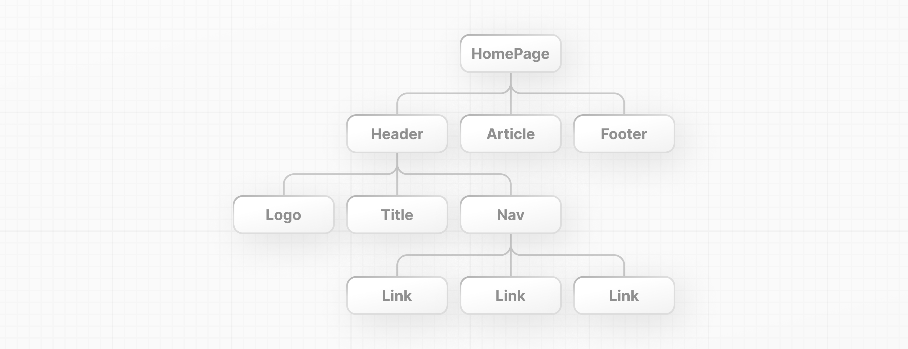

# 5장: 컴포넌트로 UI 구축하기 - Building UI with Components

## React 핵심 개념 - React core concepts

React 애플리케이션을 구축하기 시작하기 위해 알아야 할 세 가지 핵심 개념이 있습니다. 이것들은:

- 컴포넌트 (Components)
- Props
- 상태 (State)

다음 장에서는 이 개념들을 살펴보고, 추가 학습 자료를 제공할 것입니다. 이 개념들에 익숙해진 후에는 Next.js 설치 방법과 서버 및 클라이언트 컴포넌트와 같은 새로운 React 기능을 사용하는 방법을 보여드릴 것입니다.

---

## 컴포넌트 - Components

사용자 인터페이스는 **컴포넌트**라고 불리는 더 작은 구성 요소로 분해될 수 있습니다.

컴포넌트를 통해 독립적이고 재사용 가능한 코드 조각을 구축할 수 있습니다. 컴포넌트를 **레고 블록**으로 생각한다면, 이 개별 블록들을 조합하여 더 큰 구조를 형성할 수 있습니다. UI의 일부를 업데이트해야 할 경우, 특정 컴포넌트나 블록을 업데이트할 수 있습니다.


이 모듈성은 코드가 성장함에 따라 더 유지보수하기 쉽게 만들어줍니다. 애플리케이션의 나머지 부분을 건드리지 않고 컴포넌트를 추가, 업데이트, 삭제할 수 있기 때문입니다.

React 컴포넌트의 좋은 점은 그것들이 단순히 자바스크립트라는 것입니다. 자바스크립트 관점에서 React 컴포넌트를 어떻게 작성하는지 살펴보겠습니다:

---

### 컴포넌트 생성하기 - Creating components

React에서, 컴포넌트는 **함수**입니다. `script` 태그 안에서 `header`라는 새로운 함수를 생성하세요:

`index.html`

```jsx
<script type="text/jsx">
  const app = document.getElementById("app")
 
  function header() {
  }
 
  const root = ReactDOM.createRoot(app);
  root.render(<h1>Develop. Preview. Ship.</h1>);
</script>
```

컴포넌트는 **UI 요소를 반환하는** 함수입니다. 함수의 반환문 내에서 JSX를 작성할 수 있습니다:

`index.html`

```jsx
<script type="text/jsx">
  const app = document.getElementById("app")

  function header() {
    return (<h1>Develop. Preview. Ship.</h1>)
  }

  const root = ReactDOM.createRoot(app);
  root.render(<h1>Develop. Preview. Ship.</h1>);
</script>
```

이 컴포넌트를 DOM에 렌더링하려면, `root.render()` 메소드의 첫 번째 인자로 전달하세요:

`index.html`

```jsx
<script type="text/jsx">
  const app = document.getElementById("app")

  function header() {
    return (<h1>Develop. Preview. Ship.</h1>)
  }
 
  const root = ReactDOM.createRoot(app);
  root.render(header);
</script>
```

하지만, 잠깐만요. 위 코드를 브라우저에서 실행하려고 하면 오류가 발생합니다. 이를 해결하기 위해 두 가지를 해야 합니다:

첫째, React 컴포넌트는 일반 HTML 및 자바스크립트와 구분하기 위해 대문자로 시작해야 합니다:

`index.html`

```jsx
function Header() {
  return <h1>Develop. Preview. Ship.</h1>;
}

const root = ReactDOM.createRoot(app);
// React 컴포넌트 대문자화
root.render(Header);
```

둘째, 일반 HTML 태그를 사용하듯이 각 괄호 `<>`를 사용하여 React 컴포넌트를 사용해야 합니다:

`index.html`

```jsx
function Header() {
  return <h1>Develop. Preview. Ship.</h1>;
}

const root = ReactDOM.createRoot(app);
root.render(<Header />);
```

브라우저에서 코드를 다시 실행해 보면 변경사항을 볼 수 있습니다.

---

### 컴포넌트 중첩하기 - Nesting components

애플리케이션은 일반적으로 단일 컴포넌트보다 더 많은 내용을 포함합니다. 일반 HTML 요소처럼 React 컴포넌트를 서로 중첩할 수 있습니다.

예제에서 `HomePage`라는 새로운 컴포넌트를 생성하세요:

`index.html`

```jsx
function Header() {
  return <h1>Develop. Preview. Ship.</h1>;
}

function HomePage() {
  return <div></div>;
}

const root = ReactDOM.createRoot(app);
root.render(<Header />);
```

그런 다음 새로운 `<HomePage>` 컴포넌트 내에 `<Header>` 컴포넌트를 중첩하세요:

`index.html`

```jsx
function Header() {
  return <h1>Develop. Preview. Ship.</h1>;
}

function HomePage() {
  return (
    <div>
      {/* Header 컴포넌트 중첩 */}
      <Header />
    </div>
  );
}

const root = ReactDOM.createRoot(app);
root.render(<Header />);
```

---

### 컴포넌트 트리 - Component trees

이 방식으로 React 컴포넌트를 계속 중첩하여 컴포넌트 트리를 형성할 수 있습니다.



예를 들어, 최상위 `HomePage` 컴포넌트는 `Header`, `Article`, 그리고 `Footer` 컴포넌트를 포함할 수 있습니다. 그리고 각 컴포넌트는 다시 자신의 자식 컴포넌트를 가질 수 있습니다. 예를 들어, `Header` 컴포넌트는 `Logo`, `Title` 및 `Navigation` 컴포넌트를 포함할 수 있습니다.

이 모듈식 형식은 앱 내의 다른 위치에서 컴포넌트를 재사용할 수 있게 해줍니다.

프로젝트에서 `<HomePage>`가 이제 최상위 컴포넌트인 경우, `root.render()` 메소드에 전달할 수 있습니다:

`index.html`

```jsx
function Header() {
  return <h1>Develop. Preview. Ship.</h1>;
}

function HomePage() {
  return (
    <div>
      <Header />
    </div>
  );
}

const root = ReactDOM.createRoot(app);
root.render(<HomePage />);
```

> **추가 자료:**
> 
> - 첫 번째 컴포넌트
> https://react.dev/learn/your-first-component
> - 컴포넌트 가져오기 및 내보내기
> https://react.dev/learn/importing-and-exporting-components