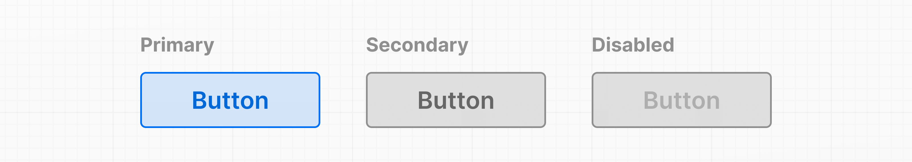

# 6장: Props를 사용하여 데이터 표시하기 - Displaying Data with Props

지금까지 `<Header />` 컴포넌트를 재사용하면, 두 번 모두 같은 내용을 표시할 것입니다.

`index.html`

```jsx
function Header() {
  return <h1>Develop. Preview. Ship.</h1>;
}

function HomePage() {
  return (
    <div>
      <Header />
      <Header />
    </div>
  );
}
```

그러나 다른 텍스트를 전달하고 싶거나, 외부 소스에서 데이터를 가져오는 경우처럼 사전에 정보를 알 수 없는 경우는 어떨까요?

일반 HTML 요소에는 해당 요소의 동작을 변경하는 정보를 전달할 수 있는 속성이 있습니다. 예를 들어, `` 요소의 `src` 속성을 변경하면 표시되는 이미지가 변경됩니다. `<a>` 태그의 `href` 속성을 변경하면 링크의 목적지가 변경됩니다.

같은 방식으로, React 컴포넌트에도 `props`라고 불리는 속성을 통해 정보를 전달할 수 있습니다. 예를 들어, 버튼의 가능한 변형을 살펴보세요:



자바스크립트 함수와 유사하게, 컴포넌트의 동작이나 화면에 표시되는 내용을 변경하는 사용자 정의 인수(또는 props)를 받아들이도록 컴포넌트를 설계할 수 있습니다. 그런 다음 이러한 props를 부모 컴포넌트에서 자식 컴포넌트로 전달할 수 있습니다.

> **참고:** React에서는 데이터가 컴포넌트 트리를 통해 아래로 흐릅니다. 이를 *단방향 데이터 흐름*이라고 합니다. 다음 장에서 논의될 상태(state)는 props로서 부모에서 자식 컴포넌트로 전달될 수 있습니다.

---

## Props 사용하기 - Using props

`HomePage` 컴포넌트에서 `Header` 컴포넌트에 사용자 정의 `title` prop을 전달할 수 있습니다. HTML 속성을 전달하는 것처럼 말이죠:

`index.html`

```jsx
function HomePage() {
  return (
    <div>
      <Header title="React" />
    </div>
  );
}
```

그리고 자식 컴포넌트인 `Header`는 첫 번째 **함수 매개변수**로서 이러한 props를 받아들일 수 있습니다:

`index.html`

```jsx
function Header(props) {
  return <h1>Develop. Preview. Ship.</h1>;
}
```

`console.log()`로 props를 출력해보면, title 속성을 가진 **객체**임을 확인할 수 있습니다.

`index.html`

```jsx
function Header(props) {
  console.log(props); // { title: "React" }
  return <h1>Develop. Preview. Ship.</h1>;
}
```

props가 객체이므로, **객체 구조 분해**를 사용하여 함수 매개변수 내에서 props의 값을 명시적으로 지정할 수 있습니다:
> **객체 구조 분해**
> https://developer.mozilla.org/docs/Web/JavaScript/Reference/Operators/Destructuring_assignment

`index.html`

```jsx
function Header({ title }) {
  console.log(title); // "React"
  return <h1>Develop. Preview. Ship.</h1>;
}
```

그런 다음 `<h1>` 태그의 내용을 title 변수로 대체할 수 있습니다.

`index.html`

```jsx
function Header({ title }) {
  console.log(title);
  return <h1>title</h1>;
}
```

브라우저에서 파일을 열면, 실제 단어 "title"이 표시됩니다. 이는 React가 단순한 텍스트 문자열을 DOM에 렌더링하려고 생각하기 때문입니다.

이것이 자바스크립트 변수임을 React에 알려줄 방법이 필요합니다.

---

## JSX에서 변수 사용하기 - Using variables in JSX

`title` prop을 사용하려면 **중괄호** `{}`를 추가하세요. 이것은 JSX 마크업 내에서 직접 일반 자바스크립트를 작성할 수 있게 해주는 특별한 JSX 문법입니다.

`index.html`

```jsx
function Header({ title }) {
  console.log(title);
  return <h1>{title}</h1>;
}
```

중괄호는 "JSX 땅"에서 "자바스크립트 땅"으로 들어가는 방법으로 생각할 수 있습니다. 중괄호 안에는 **자바스크립트 표현식**을 추가할 수 있습니다. 예를 들어:

1.  점 표기법을 사용한 **객체 속성**:

`example.js`

```jsx
function Header(props) {
  return <h1>{props.title}</h1>;
}
```

2.  **템플릿 리터럴**:

`example.js`

```jsx
function Header({ title }) {
  return <h1>{`Cool ${title}`}</h1>;
}
```

3.  **함수의 반환 값**:

`example.js`

```jsx
function createTitle(title) {
  if (title) {
    return title;
  } else {
    return 'Default title';
  }
}

function Header({ title }) {
  return <h1>{createTitle(title)}</h1>;
}
```

4.  또는 **삼항 연산자**:

`example.js`

```jsx
function Header({ title }) {
  return <h1>{title ? title : 'Default Title'}</h1>;
}
```

이제 title prop에 어떤 문자열이든 전달할 수 있으며, 삼항 연산자를 사용한 경우에는 title prop을 전혀 전달하지 않아도 됩니다. 컴포넌트에서 기본 경우를 처리했기 때문입니다:

`example.js`

```jsx
function Header({ title }) {
  return <h1>{title ? title : 'Default title'}</h1>;
}

function HomePage() {
  return (
    <div>
      <Header />
    </div>
  );
}
```

컴포넌트는 이제 일반적인 title prop을 받아들이며, 애플리케이션의 다른 부분에서 재사용할 수 있습니다. 필요한 것은 title 문자열을 변경하는 것뿐입니다:

`index.html`

```jsx
function HomePage() {
  return (
    <div>
      <Header title="React" />
      <Header title="A new title" />
    </div>
  );
}
```

---

## 리스트 순회하기 - Iterating through lists

리스트로 데이터를 표시해야 하는 경우가 흔합니다. 배열 메소드를 사용하여 데이터를 조작하고 동일한 스타일을 가진 UI 요소를 생성할 수 있지만, 다른 정보를 담을 수 있습니다.

`HomePage` 컴포넌트에 다음 이름 배열을 추가하세요:

`index.html`

```jsx
function HomePage() {
  const names = ['Ada Lovelace', 'Grace Hopper', 'Margaret Hamilton'];

  return (
    <div>
      <Header title="Develop. Preview. Ship." />
      <ul>
        {names.map((name) => (
          <li>{name}</li>
        ))}
      </ul>
    </div>
  );
}
```

`array.map()` 메소드를 사용하여 배열을 순회하고 화살표 함수를 사용하여 이름을 리스트 항목에 매핑할 수 있습니다:

`index.html`

```jsx
function HomePage() {
  const names = ['Ada Lovelace', 'Grace Hopper', 'Margaret Hamilton'];

  return (
    <div>
      <Header title="Develop. Preview. Ship." />
      <ul>
        {names.map((name) => (
          <li>{name}</li>
        ))}
      </ul>
    </div>
  );
}
```

"자바스크립트 땅"과 "JSX 땅"을 오가는 방법으로 중괄호를 사용하는 방법을 알 수 있습니다.

이 코드를 실행하면, React는 배열에서 고유하게 항목을 식별하기 위한 `key` prop이 누락되었다는 경고를 줄 것입니다. React가 DOM에서 어떤 요소를 업데이트해야 하는지 알 수 있도록 배열의 항목을 고유하게 식별할 수 있는 것이 필요하기 때문입니다.

현재 이름이 고유하기 때문에 임시로 이름을 사용할 수 있지만, 아이템 ID와 같이 고유하게 보장되는 것을 사용하는 것이 좋습니다.

`index.html`

```jsx
function HomePage() {
  const names = ['Ada Lovelace', 'Grace Hopper', 'Margaret Hamilton'];

  return (
    <div>
      <Header title="Develop. Preview. Ship." />
      <ul>
        {names.map((name) => (
          <li key={name}>{name}</li>
        ))}
      </ul>
    </div>
  );
}
```

> **추가 자료:**
> 
> - 컴포넌트에 props 전달하기
> https://react.dev/learn/passing-props-to-a-component
> - 리스트 렌더링
> https://react.dev/learn/rendering-lists
> - 조건부 렌더링
> https://react.dev/learn/conditional-rendering