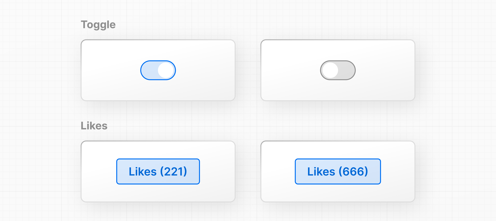

# 7장: 상태를 이용한 상호작용 추가하기 - Adding Interactivity with State

React가 **상태(state)**와 **이벤트 핸들러**를 사용하여 상호작용을 추가하는 방법을 알아봅시다.

예를 들어, `HomePage` 컴포넌트 안에 "좋아요" 버튼을 만들어 보겠습니다. 먼저, `return()` 문 내부에 버튼 요소를 추가하세요:

`index.html`

```jsx
function HomePage() {
  const names = ['Ada Lovelace', 'Grace Hopper', 'Margaret Hamilton'];

  return (
    <div>
      <Header title="Develop. Preview. Ship." />
      <ul>
        {names.map((name) => (
          <li key={name}>{name}</li>
        ))}
      </ul>
      <button>Like</button>
    </div>
  );
}
```

---

## 이벤트 듣기 - Listening to events

클릭될 때 버튼이 무언가 하도록 하려면 `onClick` 이벤트를 사용할 수 있습니다:

`index.html`

```jsx
function HomePage() {
  // ...
  return (
    <div>
      {/* ... */}
      <button onClick={}>Like</button>
    </div>
  );
}
```

React에서는 이벤트 이름이 카멜 케이스로 작성됩니다. `onClick` 이벤트는 사용자 상호작용에 응답하기 위해 사용할 수 있는 많은 가능한 이벤트 중 하나입니다. 예를 들어, 입력 필드에는 `onChange`, 폼에는 `onSubmit`을 사용할 수 있습니다.

---

## 이벤트 처리하기 - Handling events

이벤트가 트리거될 때마다 "처리"할 함수를 정의할 수 있습니다. 반환문 이전에 `handleClick()`이라는 함수를 생성하세요:

`index.html`

```jsx
function HomePage() {
  // ...

  function handleClick() {
    console.log("increment like count")
  }

  return (
    <div>
      {/* ... */}
      <button onClick={handleClick}>Like</button>
    </div>
     )
   }
```

그런 다음 `onClick` 이벤트가 트리거될 때 `handleClick` 함수를 호출할 수 있습니다:

`index.html`

```jsx
function HomePage() {
  // ...
  function handleClick() {
    console.log('increment like count');
  }

  return (
    <div>
      {/* ... */}
      <button onClick={handleClick}>Like</button>
    </div>
  );
}
```

브라우저에서 이를 실행해보세요. 개발자 도구에서 로그 출력이 증가하는 것을 볼 수 있습니다.

---

## 상태와 훅 - State and hooks

React에는 **훅(hooks)** 이라고 불리는 함수 세트가 있습니다. 훅을 사용하면 컴포넌트에 **상태**와 같은 추가 로직을 추가할 수 있습니다. 상태는 사용자 상호작용에 의해 보통 변경되는 시간에 따라 UI 내의 모든 정보로 생각할 수 있습니다.
> 훅(hooks) https://react.dev/learn



사용자가 "좋아요" 버튼을 클릭한 횟수를 저장하고 증가시키기 위해 *상태*를 사용할 수 있습니다. 실제로 상태를 관리하는 React 훅은 `useState()`입니다.

`useState()`를 프로젝트에 추가하세요. 이것은 배열을 반환하며, 배열 구조 분해를 사용하여 컴포넌트 내에서 이 배열 값을 접근하고 사용할 수 있습니다:

`index.html`

```jsx
function HomePage() {
  // ...
  const [] = React.useState();

  // ...
}
```

배열의 첫 번째 항목은 상태 `value`이며, 이것은 원하는 대로 이름을 지을 수 있습니다. 설명적인 이름을 사용하는 것이 좋습니다:

`index.html`

```jsx
function HomePage() {
  // ...
  const [likes] = React.useState();

  // ...
}
```

배열의 두 번째 항목은 값을 `업데이트`하는 함수입니다. 업데이트 함수는 원하는 대로 이름을 지을 수 있지만, 업데이트하는 상태 변수의 이름 앞에 `set`을 붙이는 것이 일반적입니다:

`index.html`

```jsx
function HomePage() {
  // ...
  const [likes, setLikes] = React.useState();

  // ...
}
```

`likes` 상태의 초기 값을 `0`으로 추가할 기회도 있습니다:

`index.html`

```jsx
function HomePage() {
  // ...
  const [likes, setLikes] = React.useState(0);
}
```

그런 다음 컴포넌트 내에서 상태 변수를 사용하여 초기 상태가 작동하는지 확인할 수 있습니다.

`index.html`

```jsx
function HomePage() {
  // ...
  const [likes, setLikes] = React.useState(0);
  // ...

  return (
    // ...
    <button onClick={handleClick}>Like({likes})</button>
  );
}
```

마지막으로, `HomePage` 컴포넌트에서 상태 업데이터 함수인 `setLikes`를 호출할 수 있습니다. 이전에 정의한 `handleClick()` 함수 내에 추가해봅시다:

`index.html`

```jsx
function HomePage() {
  // ...
  const [likes, setLikes] = React.useState(0);

  function handleClick() {
    setLikes(likes + 1);
  }

  return (
    <div>
      {/* ... */}
      <button onClick={handleClick}>Likes ({likes})</button>
    </div>
  );
}
```

버튼을 클릭하면 `handleClick` 함수가 호출되며, 이 함수는 현재 좋아요 수 + 1인 단일 인수와 함께 `setLikes` 상태 업데이터 함수를 호출합니다.

> **참고**: props는 첫 번째 함수 매개변수로 컴포넌트에 전달되는 반면, 상태는 컴포넌트 내에서 초기화되고 저장됩니다. 상태 정보를 자식 컴포넌트에 props로 전달할 수 있지만, 상태를 업데이트하는 로직은 상태가 처음 생성된 컴포넌트 내부에 유지해야 합니다.

---

## 상태 관리 - Managing state

이것은 상태에 대한 소개였으며, React 애플리케이션에서 상태와 데이터 흐름을 관리하는 방법에 대해 더 많이 배울 수 있습니다. 더 배우고 싶다면 React 문서의 **상호작용 추가하기** 및 **상태 관리하기** 섹션을 통해 학습하는 것이 좋습니다.
> 상호작용 추가하기 https://react.dev/learn/adding-interactivity
> 상태 관리하기 https://react.dev/learn/managing-state

> **추가 자료:**
> 
> - 상태: 컴포넌트의 메모리
> https://react.dev/learn/state-a-components-memory
> - 첫 번째 훅 만나기
> https://react.dev/learn/state-a-components-memory#meet-your-first-hook
> - 이벤트에 응답하기
> https://react.dev/learn/responding-to-events